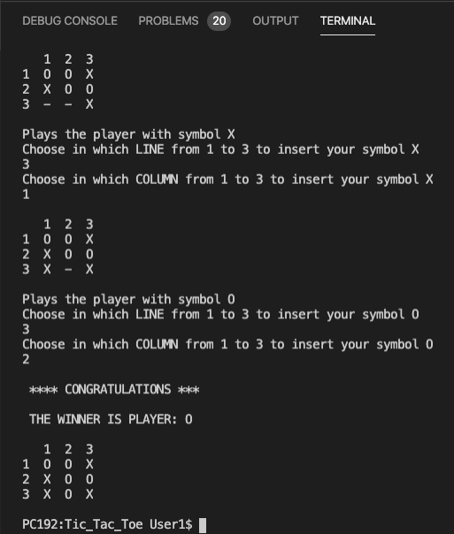

# C++ Tic Tac Toe game
This is the classic 2 player game Tic Tac Toe in C++. 
<<<<<<< HEAD
For now needs an sort update to avoid hanging when a character entered instead of a number for x/y coordinates.
=======
>>>>>>> 098dc8034b0ec857dedb43a0e2f98b8029871779

## How is working
The player is giving the coordinates for the row and the column by eac one player.
If a cell is not empty asking again the player to enter another cell.
After each move is checking if some player has 3 same symbols in a row or in a column or diagonal.


<<<<<<< HEAD

=======

>>>>>>> 098dc8034b0ec857dedb43a0e2f98b8029871779


## Cloning

Using HTTPS:
```
git clone https://github.com/vatsilidis/Cpp_Tic_Tac_Toe.git
```

## To the future
The next future update will be to add GUI with QT Framework.

# Compile and run 

### To compile run
`g++ main.cpp` 

### To compile in MacOS run
`g++ main.cpp tictactoe.cpp`

### To play run
`./a.out`


## Contributors
* [Lampros Vatsilidis](https://www.linkedin.com/in/lampros-vatsilidis-5666ba128/)
 
